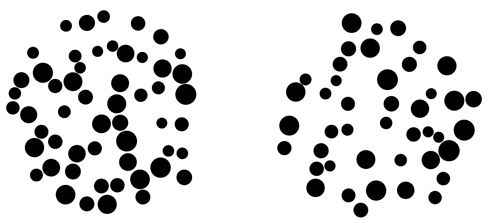

```{r}
#| include: false
library(tidyverse)
accent <- "#BE0000"
```

## The Approximate Number System

The Approximate Number System (ANS) is the capacity to represent and compare numerical quantities without counting or symbolic number [@dehaene1997numbersense; @feigenson2004core].

- Present from infancy, and shared with non-human animals
- Operates over large, uncounted sets, in parallel with exact, symbolic number
- Precision is ratio-dependent: discriminating 10 vs. 20 is easy, 18 vs. 20 is harder, which is the same as 180 vs. 200, etc.

The standard experimental paradigm: which of two dot arrays is more numerous?

## The Mental Number Line

A widely held account: a set of size $n$ is represented internally as a Gaussian random variable centred on $n$, with standard deviation proportional to $n$.

```{r}
#| fig-width: 8
#| fig-height: 4.5
#| out-width: 850px
#| fig-align: center
n_vals <- c(6, 10, 16, 24)
mnl_df <- map_dfr(n_vals, function(set_size) {
  sd_n <- set_size / 5
  x <- seq(max(0, set_size - 4 * sd_n), set_size + 4 * sd_n, length.out = 300)
  tibble(n = factor(set_size), x = x, y = dnorm(x, mean = set_size, sd = sd_n))
})

ggplot(mnl_df, aes(x = x, y = y, colour = n)) +
  geom_line(linewidth = 1.3) +
  scale_colour_manual(values = c("#333333", "#8a8a8a", "#c98a8a", accent)) +
  labs(x = "Represented numerosity", y = NULL, colour = "True set size") +
  theme_classic(base_size = 20) +
  theme(
    axis.text.y = element_blank(),
    axis.ticks.y = element_blank(),
    legend.position = "top",
    text = element_text(colour = "#000000")
  )
```

Larger, more overlapping distributions for larger $n$: this is Weber's law applied to number, and it is the basis of ratio-dependent discrimination.

## Why the ANS Matters

- ANS acuity (the precision of this internal representation) correlates with symbolic mathematical achievement, across childhood and into adulthood [@halberda2008individual]
- This holds even controlling for general intelligence and other cognitive factors
- Raises the possibility that atypical ANS function contributes to atypical mathematical development, including developmental dyscalculia

This motivates asking not just whether the ANS predicts maths ability, but what, mechanistically, differs in the individuals for whom it does not.

## Neural Signatures of the ANS: What Is Known

Numerosity-evoked potentials in posterior/parietal EEG show a consistent sequence of components, each with a distinct functional profile:

```{r}
#| fig-width: 9
#| fig-height: 4.5
#| out-width: 900px
#| fig-align: center

# Peak height of a Gaussian bump is its coefficient divided by its width,
# not the coefficient alone. P2p's coefficient and width are set so it
# renders as clearly the tallest peak (~1.8 vs P1's ~0.94), and its width
# (40) is chosen so its half-max extent (roughly 213-289ms) sits inside
# the widened 200-300ms shaded window below, rather than spilling well
# past it the way the original 250ms-wide window did against a wider peak.
t <- seq(-100, 500, length.out = 1000)
erp <- function(t) {
  ifelse(
    t < 0,
    0,
    1.1 * dnorm(t, 110, 25) - 1.8 * dnorm(t, 175, 30) + 3.2 * dnorm(t, 240, 40)
  ) *
    60
}
erp_df <- tibble(t = t, v = erp(t))

windows <- tibble(
  label = c("P1", "N1", "P2p"),
  xmin = c(80, 150, 200),
  xmax = c(150, 200, 300),
  y = c(1.5, -1.5, 3.4)
)
boundaries <- c(80, 150, 200, 300)

ggplot() +
  geom_rect(
    data = windows,
    aes(xmin = xmin, xmax = xmax, ymin = -Inf, ymax = Inf, fill = label),
    alpha = 0.10,
    show.legend = FALSE
  ) +
  scale_fill_manual(values = c(P1 = "#999999", N1 = "#999999", P2p = accent)) +
  geom_vline(
    xintercept = boundaries,
    colour = "#cccccc",
    linewidth = 0.4,
    linetype = "dashed"
  ) +
  geom_hline(yintercept = 0, colour = "#999999", linewidth = 0.4) +
  geom_vline(xintercept = 0, colour = "#666666", linewidth = 0.5) +
  geom_line(
    data = erp_df,
    aes(x = t, y = v),
    colour = "#000000",
    linewidth = 1.3
  ) +
  geom_text(
    data = windows,
    aes(x = (xmin + xmax) / 2, y = y, label = label, colour = label),
    fontface = "italic",
    size = 7,
    show.legend = FALSE
  ) +
  scale_colour_manual(
    values = c(P1 = "#555555", N1 = "#555555", P2p = accent)
  ) +
  labs(x = "Time from stimulus onset (ms)", y = "Amplitude (schematic)") +
  theme_classic(base_size = 20) +
  theme(axis.text.y = element_blank(), axis.ticks.y = element_blank())
```

Timings and functional dissociation from the numerosity-adaptation literature, notably @grasso2022.

## P1: An Early, Stimulus-Driven Response

**P1**, ~80-150ms, posterior positivity.

- Modulated by real differences in dot count between conditions
- Unaffected by an illusion that changes perceived numerosity without changing the physical display [@grasso2022]
- Reflects the physical stimulus, not (yet) the perceptual estimate

## N1: Individuating Small Arrays

**N1**, ~150-200ms, a negative-going deflection between P1 and P2p.

- Within the subitizing range (1-3 items), modulated by absolute number specifically, and tied to attending to and individuating locations, not an abstract sense of quantity [@hydespelke2009]
- Outside that range, it behaves more like P1: modulated by physical numerosity, unaffected by the perceptual illusion, "virtually overlapped" across conditions that differ only in perceived number [@grasso2022; @fornaciai2017]
- An earlier, more stimulus-driven stage than P2p

## P2p: The Candidate ANS Signature

**P2p**, ~200-250ms, "P2, parietal" (to distinguish it from the unrelated centro-frontal P2/P200).

- Tracks perceived, not physical, numerosity
- Shrinks under the same adaptation illusion that leaves P1 and N1 unchanged, and that shrinkage correlates with participants' own behavioural underestimation [@grasso2022]
- Modulated by numerical distance/ratio, specifically over large numerical ranges [@libertus2007; @park2016rapid]

The leading candidate for the neural signature of ANS processing specifically, as opposed to low-level visual processing of the display.

## Open Questions

- How much do P1/N1/P2p vary, trial to trial and person to person?
- Individual differences in P2p, and their relationship to behavioural ANS acuity, are largely unexplored
- How does the waveform change continuously as stimulus properties (numerical ratio, array density) vary?
- The developmental trajectory of these specific components is not well characterised
- Whether, and how, differences in this neural signature relate to atypical numerical development remains an open question

## Motivation: Why Multilevel Nonlinear Models?

The standard analysis pipeline discards exactly the information most of the open questions above need:

- Trial-to-trial variability, averaged away before it can be modelled
- Subject-to-subject variability in waveform shape, not just amplitude
- Continuous relationships between stimulus properties and the waveform, forced into discrete condition contrasts

Model the single-trial voltage waveform itself, at every electrode, as a smooth random function of time, varying systematically with stimulus properties and probabilistically across trials and participants.

## From Linear Regression to Basis Functions

An normal linear model of time $t$: $y_t = w_0 + w_1 \cdot t + \epsilon_t$.

A nonlinear function can be modelled as a linear sum of $K$ basis functions of time, $\phi_1(t), \dots, \phi_K(t)$: 
$$
y_t = w_0 + \sum_{k=1}^{K} w_k\, \phi_k(t) + \epsilon_t.
$$

- The $\phi_k$ are deterministic functions (e.g., Gaussian radial basis functions) with hyperparameters
- The weights $w_k$ are regression coefficients estimated from data
- This is exactly the same trick as polynomial or spline regression: nonlinear in time, linear in the weights

## From Random Slopes to Random Functions

A linear mixed effects (multilevel linear) model gives each subject their own intercept and slope:
$$
\begin{aligned}
y_{ij} &= \beta_{0j} + \beta_{1j} x_{ij} + \epsilon_{ij}.\\
       &= (b_0 + u_{0j}) + (b_1 + u_{1j}) x_{ij} + \epsilon_{ij}.
\end{aligned}
$$

Generalising this to the basis-function model above: give every weight $w_k$ its own subject deviation, and its own trial deviation:
$$
w_k(\text{subject}, \text{trial}) = w_k^{(0)} + u_{k,\,\text{subject}} + v_{k,\,\text{trial}}.
$$

A subject or trial gets its own random function, a whole waveform shape deviating from the population-average waveform.

## Stimulus Covariates: Changing the Waveform Shape

A covariate like numerosity ratio has to be able to change where and how the waveform differs, e.g., at P2p specifically, not everywhere at once.

That means it enters the same way subject and trial do, as its own $K$-vector of coefficients on the basis expansion:
$$
w_k = w_k^{(0)} + \gamma_k^{\text{ratio}} \, x^{\text{ratio}} + \, \cdots \, + b_{k,\,\text{subject}} + b_{k,\,\text{trial}}.
$$

## What Adding a Covariate Buys Us {visibility="hidden"}

$\gamma^{\text{ratio}}$ is itself a whole basis-function-shaped effect, one coefficient per basis function, not a single number.

- A unit change in ratio shifts the entire predicted waveform shape, not a single peak height
- The model can ask which part of the waveform tracks task difficulty, rather than assuming that in advance
- The same logic extends to any other stimulus property: density, numerosity itself, condition (numerosity vs. control)

## The Behavioural Task

All participants completed a two-alternative forced-choice task, PsychoPy-based, EEG-synchronised via trigger codes at stimulus onset and response.

- Two dot arrays shown side by side; judge, via a left or right key press, which array is more numerous
- The display remains on screen until the participant responds, or a per-trial timeout elapses
- Followed by an inter-stimulus interval before the next trial

## Task Stimuli

{width="750px" fig-align="center"}

## EEG Recording and Preprocessing

- 64-channel BioSemi ActiveTwo recording, downsampled to 1024 Hz
- Independent Component Analysis, with automated component labelling (ICLabel), to remove ocular, muscle, and other non-neural artefacts
- 1-30 Hz band-pass filter; re-referenced to the average of all channels
- Epoched -200 to 1000ms relative to stimulus onset, baseline-corrected
- AutoReject applied per channel per trial, to repair or flag residual artefacts

A fixed, reproducible pipeline: every participant's data passes through exactly the same sequence of steps.

```{r}
#| include: false

# Behavioural results: reads data/main/combined_behaviour_data.csv
# directly, not the merged EEG parquet, since this is the same
# behavioural data (scripts/merge_eeg_behaviour_data.R reads this exact
# CSV and left-joins it onto the EEG epochs) and is small enough to read
# on every render. Dots task only, adults only (all 48 subjects in this
# file are ages 18-47, checked directly; the children's data isn't in
# this file at all, so there's no filtering to do).
dots_df <- read_csv("../../data/main/combined_behaviour_data.csv") |>
  filter(type == "dots") |>
  drop_na(left_size, right_size, accuracy, rt) |>
  mutate(
    delta = abs(left_size - right_size),
    # Ratio of larger to smaller, always >= 1, as a percentage (100 =
    # equal, 140 = the larger array has 40% more dots), rounded to the
    # nearest 5 points so per-subject averages have enough trials behind
    # each point to be worth plotting.
    ratio_pct = round(
      (pmax(left_size, right_size) / pmin(left_size, right_size)) * 100 / 5
    ) *
      5
  )

dots_accuracy_by_delta <- dots_df |>
  summarize(accuracy = mean(accuracy), .by = c(subject, delta))
dots_accuracy_by_ratio <- dots_df |>
  summarize(accuracy = mean(accuracy), .by = c(subject, ratio_pct))
dots_rt_by_delta <- dots_df |>
  filter(accuracy) |>
  summarize(rt = mean(rt), .by = c(subject, delta))
dots_rt_by_ratio <- dots_df |>
  filter(accuracy) |>
  summarize(rt = mean(rt), .by = c(subject, ratio_pct))

# k defaults to mgcv's own default (10). The ratio plots pass k = 6
# explicitly: every subject has only 9 distinct ratio_pct values, one
# fewer than the default number of knots, which makes gam() error out
# per subject and stat_smooth silently drop that subject's line.
noodle_plot <- function(df, x, y, xlab, ylim = NULL, k = 10) {
  smooth_formula <- as.formula(str_c("y ~ s(x, bs = 'cs', k = ", k, ")"))
  p <- df |>
    ggplot(aes(x = .data[[x]], y = .data[[y]])) +
    geom_line(
      aes(group = subject),
      stat = "smooth",
      method = "gam",
      formula = smooth_formula,
      alpha = 0.33,
      linetype = "dashed"
    ) +
    geom_line(
      stat = "smooth",
      method = "gam",
      formula = smooth_formula,
      colour = accent,
      linewidth = 1.5
    ) +
    theme_minimal(base_size = 18) +
    theme(legend.position = "none") +
    labs(x = xlab, y = y)
  if (!is.null(ylim)) {
    p <- p + coord_cartesian(ylim = ylim)
  }
  p
}

subj_accuracy <- dots_df |> summarize(accuracy = mean(accuracy), .by = subject)
subj_rt <- dots_df |>
  filter(accuracy) |>
  summarize(rt = mean(rt), .by = subject)
within_subj_rt_sd <- dots_df |>
  filter(accuracy) |>
  summarize(sd = sd(rt), .by = subject)

# Speed-accuracy trade-off: mean RT over all trials (not accurate-only),
# since accurate-only RT would remove exactly the fast-but-wrong trials
# that a genuine speed-accuracy trade-off shows up in.
sa_df <- dots_df |>
  summarize(accuracy = mean(accuracy), rt = mean(rt), .by = subject)
sa_cor <- cor(sa_df$accuracy, sa_df$rt)
```

## Behavioural Results: Accuracy

Dots task, adults, `r n_distinct(dots_df$subject)` participants, `r nrow(dots_df)` trials.

- Overall accuracy: `r round(mean(dots_df$accuracy) * 100, 1)`%
- Across participants: from `r round(min(subj_accuracy$accuracy) * 100, 1)`% to `r round(max(subj_accuracy$accuracy) * 100, 1)`% (SD `r round(sd(subj_accuracy$accuracy) * 100, 1)` points)
- Within a participant, accuracy varies systematically with how different the two arrays are, not randomly: see the next two slides

## Average Accuracy by Dot Count Difference

```{r}
#| fig-width: 8
#| fig-height: 5
#| out-width: "67%"
#| fig-align: center
noodle_plot(
  dots_accuracy_by_delta,
  "delta",
  "accuracy",
  "Dot count difference",
  ylim = c(0, 1.1)
)
```

## Average Accuracy by Dot Count Ratio

```{r}
#| fig-width: 8
#| fig-height: 5
#| out-width: "67%"
#| fig-align: center
noodle_plot(
  dots_accuracy_by_ratio,
  "ratio_pct",
  "accuracy",
  "Larger/smaller dot count (%)",
  ylim = c(0, 1.1),
  k = 6
)
```

## Behavioural Results: Reaction Time

Accurate trials only.

- Overall: mean `r round(mean(subj_rt$rt), 2)`s, median `r round(median(dots_df$rt[dots_df$accuracy]), 2)`s (right-skewed, as RT distributions usually are)
- Across participants: from `r round(min(subj_rt$rt), 2)`s to `r round(max(subj_rt$rt), 2)`s (SD `r round(sd(subj_rt$rt), 2)`s)
- Within a participant, trial-to-trial variability is real too: mean within-participant SD `r round(mean(within_subj_rt_sd$sd), 2)`s, comparable in size to the between-participant spread

## Average Reaction Time by Dot Count Difference

Accurate trials only.

```{r}
#| fig-width: 8
#| fig-height: 5
#| out-width: "67%"
#| fig-align: center
noodle_plot(dots_rt_by_delta, "delta", "rt", "Dot count difference")
```

## Average Reaction Time by Dot Count Ratio

Accurate trials only.

```{r}
#| fig-width: 8
#| fig-height: 5
#| out-width: "67%"
#| fig-align: center
noodle_plot(
  dots_rt_by_ratio,
  "ratio_pct",
  "rt",
  "Larger/smaller dot count (%)",
  k = 6
)
```

## Speed-Accuracy Trade-off

One point per participant: mean accuracy against mean reaction time (all trials).

```{r}
#| fig-width: 8
#| fig-height: 4.8
#| fig-align: center
sa_df |>
  ggplot(aes(x = accuracy, y = rt, label = subject)) +
  geom_text(check_overlap = TRUE, size = 3) +
  geom_smooth(method = "lm", colour = accent, fill = accent, alpha = 0.15) +
  theme_classic(base_size = 18) +
  labs(x = "Mean accuracy", y = "Mean reaction time (s)")
```

Correlation: r = `r round(sa_cor, 2)`, weak, but in the direction a speed-accuracy trade-off predicts: slower participants tend to be slightly more accurate.

## Grand-Average ERPs by Electrode

Grand average (all subjects, all trials) at a representative subset of electrodes, not all 64: anterior (AF) at top, central (C) in the middle, parieto-occipital (PO/P) at the bottom.

```{r}
#| include: false

# Reads a precomputed summary, not the merged EEG parquet directly: that
# file is multi-gigabyte and arrow alone makes it too slow to read on
# every render. tmp/grand_average_erp.rds is written once by
# analysis/prepare_presentation_data.R (grand-average voltage per
# channel per timepoint, all 64 channels, dots task only, the same
# collapse-over-subject-and-trial approach as analysis/aug26_1.R's
# Figure x.3), run separately inside the devcontainer. Not committed,
# not kept long-term; see the 27 August 2026 logbook entry for what it
# contains and how to regenerate it if tmp/ has been cleared. Guarded
# with file.exists() rather than a bare readRDS(), so a missing file
# here shows one placeholder slide instead of failing the whole render:
# this document has many slides that have nothing to do with EEG data
# and shouldn't be held hostage by one missing tmp/ file.
grand_average_data_path <- "../../tmp/grand_average_erp.rds"
grand_average_erp <- if (file.exists(grand_average_data_path)) {
  readRDS(grand_average_data_path)
} else {
  NULL
}

# Central (C): the sensorimotor strip, expected to show little relative
# to the visual task here. Anterior (AF): expected to broadly mirror the
# posterior sites. Parieto-occipital (PO/P): where P1/N1/P2p live.
# Ordered as a factor, not left alphabetical, so facet_wrap lays out
# rows by region (AF, then C, then PO, then P) rather than by channel
# name.
selected_channels <- c(
  "AF3",
  "AFz",
  "AF4",
  "C3",
  "Cz",
  "C4",
  "PO7",
  "POz",
  "PO8",
  "P7",
  "Pz",
  "P8"
)
```

```{r}
#| fig-width: 9
#| fig-height: 9
#| out-width: "700px"
#| fig-align: center
if (is.null(grand_average_erp)) {
  ggplot() +
    annotate(
      "text",
      x = 0,
      y = 0,
      size = 5,
      colour = accent,
      label = "tmp/grand_average_erp.rds not found.\nRun analysis/prepare_presentation_data.R in the devcontainer."
    ) +
    theme_void()
} else {
  grand_average_erp |>
    filter(channel %in% selected_channels) |>
    mutate(channel = factor(channel, levels = selected_channels)) |>
    ggplot(aes(x = time, y = voltage)) +
    geom_line() +
    facet_wrap(~channel, ncol = 3, scales = "fixed") +
    theme_minimal(base_size = 14) +
    labs(x = "Time from stimulus onset (ms)", y = "Voltage (µV)")
}
```

## Parieto-Occipital Electrodes

Black: each participant's own average waveform. Red: the grand average across participants.

```{r}
#| include: false

# Reads a second precomputed summary, subject-level this time, not just
# the pooled grand average: analysis/prepare_presentation_data.R writes
# this alongside tmp/grand_average_erp.rds, restricted to these five
# channels specifically since the subject breakdown is a much larger
# table than the channel-only one above. Same file, same regeneration
# instructions as the previous slide.
subject_erp_path <- "../../tmp/subject_average_erp_posterior.rds"
subject_average_erp_posterior <- if (file.exists(subject_erp_path)) {
  readRDS(subject_erp_path)
} else {
  NULL
}

posterior_channels <- c("POz", "Oz", "Pz", "PO7", "PO8")
```

```{r}
#| fig-width: 12
#| fig-height: 4
#| out-width: "950px"
#| fig-align: center
if (is.null(subject_average_erp_posterior)) {
  ggplot() +
    annotate(
      "text",
      x = 0,
      y = 0,
      size = 5,
      colour = accent,
      label = "tmp/subject_average_erp_posterior.rds not found.\nRun analysis/prepare_presentation_data.R in the devcontainer."
    ) +
    theme_void()
} else {
  channel_grand_avg <- subject_average_erp_posterior |>
    summarise(voltage = mean(voltage), .by = c(channel, time)) |>
    mutate(channel = factor(channel, levels = posterior_channels))

  subject_average_erp_posterior |>
    mutate(channel = factor(channel, levels = posterior_channels)) |>
    ggplot(aes(x = time, y = voltage)) +
    geom_line(aes(group = subject), colour = "black", alpha = 0.2) +
    geom_line(data = channel_grand_avg, colour = accent, linewidth = 1) +
    facet_wrap(~channel, nrow = 1, scales = "fixed") +
    theme_minimal(base_size = 14) +
    labs(x = "Time from stimulus onset (ms)", y = "Voltage (µV)")
}
```

## Inter-Trial Variability, One Participant

Black: every individual trial for one participant (s47). Red: that participant's own average waveform.

```{r}
#| include: false

# A third precomputed summary, single-trial resolution this time, for
# one participant only: analysis/prepare_presentation_data.R writes this
# alongside the two files above, restricted to one subject (s47) and the
# same five channels, since full single-trial resolution across every
# participant would be close to the whole dataset again. Same
# regeneration instructions as the previous two slides.
trial_erp_path <- "../../tmp/trial_erp_posterior_s47.rds"
trial_erp_posterior <- if (file.exists(trial_erp_path)) {
  readRDS(trial_erp_path)
} else {
  NULL
}
```

```{r}
#| fig-width: 12
#| fig-height: 4
#| out-width: "950px"
#| fig-align: center
if (is.null(trial_erp_posterior)) {
  ggplot() +
    annotate(
      "text",
      x = 0,
      y = 0,
      size = 5,
      colour = accent,
      label = "tmp/trial_erp_posterior_s47.rds not found.\nRun analysis/prepare_presentation_data.R in the devcontainer."
    ) +
    theme_void()
} else {
  subject_grand_avg <- trial_erp_posterior |>
    summarise(voltage = mean(voltage), .by = c(channel, time)) |>
    mutate(channel = factor(channel, levels = posterior_channels))

  trial_erp_posterior |>
    mutate(channel = factor(channel, levels = posterior_channels)) |>
    ggplot(aes(x = time, y = voltage)) +
    geom_line(aes(group = trial_id), colour = "black", alpha = 0.1) +
    geom_line(data = subject_grand_avg, colour = accent, linewidth = 1) +
    facet_wrap(~channel, nrow = 1, scales = "fixed") +
    theme_minimal(base_size = 14) +
    labs(x = "Time from stimulus onset (ms)", y = "Voltage (µV)")
}
```

## Multilevel Model: Variability Across Subjects

A first fit of the multilevel model at POz: each participant's own fitted average waveform (black) around the fitted population average (red).

```{r}
#| include: false
m0_fitted_path <- "../../tmp/m0_fitted.rds"
m0_fitted <- if (file.exists(m0_fitted_path)) readRDS(m0_fitted_path) else NULL
```

```{r}
#| fig-width: 9
#| fig-height: 5
#| out-width: "750px"
#| fig-align: center
if (is.null(m0_fitted)) {
  ggplot() +
    annotate(
      "text",
      x = 0,
      y = 0,
      size = 5,
      colour = accent,
      label = "tmp/m0_fitted.rds not found.\nRun analysis/prepare_presentation_models.R."
    ) +
    theme_void()
} else {
  ggplot() +
    geom_line(
      data = m0_fitted,
      aes(x = time, y = fitted_subject, group = subject),
      colour = "black",
      alpha = 0.3
    ) +
    geom_line(
      data = distinct(m0_fitted, time, fitted_population),
      aes(x = time, y = fitted_population),
      colour = accent,
      linewidth = 1
    ) +
    theme_minimal(base_size = 14) +
    labs(x = "Time from stimulus onset (ms)", y = "Voltage (µV)")
}
```

## Multilevel Model: Variability Across Trials

The same kind of model, now for one participant (s47): every individual trial's fitted curve (black) around that participant's own fitted average (red).

```{r}
#| include: false
m1_fitted_path <- "../../tmp/m1_fitted_s47.rds"
m1_fitted <- if (file.exists(m1_fitted_path)) readRDS(m1_fitted_path) else NULL
```

```{r}
#| fig-width: 9
#| fig-height: 5
#| out-width: "750px"
#| fig-align: center
if (is.null(m1_fitted)) {
  ggplot() +
    annotate(
      "text",
      x = 0,
      y = 0,
      size = 5,
      colour = accent,
      label = "tmp/m1_fitted_s47.rds not found.\nRun analysis/prepare_presentation_models.R."
    ) +
    theme_void()
} else {
  ggplot() +
    geom_line(
      data = m1_fitted,
      aes(x = time, y = fitted_trial, group = trial_id),
      colour = "black",
      alpha = 0.05
    ) +
    geom_line(
      data = distinct(m1_fitted, time, fitted_population),
      aes(x = time, y = fitted_population),
      colour = accent,
      linewidth = 1
    ) +
    theme_minimal(base_size = 14) +
    labs(x = "Time from stimulus onset (ms)", y = "Voltage (µV)")
}
```

## Multilevel Model: Subjects and Trials Together

Both sources of variability in one model: participant s47's individual trials (black) around their own fitted average (red).

```{r}
#| include: false
m2_fitted_path <- "../../tmp/m2_fitted_s47.rds"
m2_fitted <- if (file.exists(m2_fitted_path)) readRDS(m2_fitted_path) else NULL
```

```{r}
#| fig-width: 9
#| fig-height: 5
#| out-width: "750px"
#| fig-align: center
if (is.null(m2_fitted)) {
  ggplot() +
    annotate(
      "text",
      x = 0,
      y = 0,
      size = 5,
      colour = accent,
      label = "tmp/m2_fitted_s47.rds not found.\nRun analysis/prepare_presentation_models.R."
    ) +
    theme_void()
} else {
  ggplot() +
    geom_line(
      data = m2_fitted,
      aes(x = time, y = fitted_full, group = trial_id),
      colour = "black",
      alpha = 0.15
    ) +
    geom_line(
      data = distinct(m2_fitted, time, fitted_subject),
      aes(x = time, y = fitted_subject),
      colour = accent,
      linewidth = 1
    ) +
    theme_minimal(base_size = 14) +
    labs(x = "Time from stimulus onset (ms)", y = "Voltage (µV)")
}
```

## Fitted Population Waveform: P1, N1, P2p

The grand average (faint grey) against the model's fitted population curve (red), POz.

```{r}
#| include: false
grand_average_poz_path <- "../../tmp/grand_average_erp.rds"
m2_population_path <- "../../tmp/m2_fitted_s47.rds"

grand_average_poz <- if (file.exists(grand_average_poz_path)) {
  readRDS(grand_average_poz_path) |> filter(channel == "POz")
} else {
  NULL
}

m2_population <- if (file.exists(m2_population_path)) {
  readRDS(m2_population_path) |> distinct(time, fitted_population)
} else {
  NULL
}
```

```{r}
#| fig-width: 9
#| fig-height: 5
#| out-width: "750px"
#| fig-align: center
if (is.null(grand_average_poz) || is.null(m2_population)) {
  ggplot() +
    annotate(
      "text",
      x = 0,
      y = 0,
      size = 5,
      colour = accent,
      label = "Data not found.\nRun analysis/prepare_presentation_data.R and analysis/prepare_presentation_models.R."
    ) +
    theme_void()
} else {
  ggplot() +
    geom_line(
      data = grand_average_poz,
      aes(x = time, y = voltage),
      colour = "grey60",
      linewidth = 0.4,
      alpha = 0.6
    ) +
    geom_line(
      data = m2_population,
      aes(x = time, y = fitted_population),
      colour = accent,
      linewidth = 1.3
    ) +
    theme_minimal(base_size = 14) +
    labs(x = "Time from stimulus onset (ms)", y = "Voltage (µV)")
}
```

## Conclusion

- Multilevel nonlinear modelling keeps what standard averaged-ERP analysis throws away: trial-to-trial variability, subject-level waveform shape, continuous stimulus effects
- That is exactly what the open questions raised earlier need: individual differences in P2p, continuous effects of ratio and density, developmental trajectories, atypical development
- What has been shown today is a proof of concept for the method itself, not yet answers to those questions
- Current work: a flexible yet efficient fully Bayesian implementation in Stan

## References
::: {#refs}
:::
